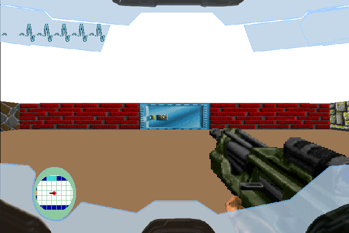

# ld_cub3d
A 42 school's project

> :warning: **Warning**: It is educational project.

> :warning: **Warning**: You can take inspiration from it but don't copy / paste what you don't understand.

In this repository you will find the "game" inspired by Wolfenstein 3D. You can launch with the 'make exec1/2/3' command.
You have also a correction sheet in pdf format.

## WHAT'S INSIDE ?

* WASD to move, QE or Left/Right directional keys to rotate camera
* ESC or the cross to quit

## BONUS

* Collision with walls
* HUD
* Shift to fire
* Fog of war on walls
* electrocardiogram (health bar)
* other objects
* Collision with sprites
* Win / Loose HP
* Openable doors
* Secrete Door
* Animated gun
* many levels
* Gun and enemy
* multi-language error manager
* multi-threading raycast
* sensor / map
